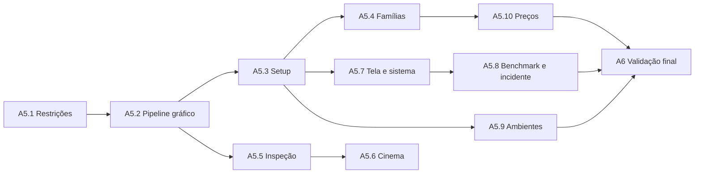

# Roadmap de implementação — Hardware Studio 3D

## Sequência obrigatória

### A5.1 — Restrições espaciais e correção de bugs

Entregas:

- `scene-constraints.js`;
- zonas de apoio;
- colisão de setup;
- escala e pivôs;
- limites da mesa;
- correção de monitor/periféricos flutuando;
- câmera segura.

Gate:

- nenhum objeto flutuando;
- nenhuma interpenetração grave;
- A1, A2 e A3 preservadas.

### A5.2 — Materiais, texturas, shaders e qualidade Ultra

Entregas:

- `material-pipeline.js`;
- perfis PBR;
- vidro;
- metais e plásticos;
- RGB;
- sombras e iluminação;
- níveis de textura;
- fallback.

Gate:

- quatro níveis gráficos funcionais;
- modo Baixo preservado;
- Ultra visualmente superior em aparelho capaz.

### A5.3 — Setup, periféricos e múltiplos monitores

Entregas:

- `setup-engine.js`;
- mesas iniciais;
- 1/2/3 telas;
- suportes;
- teclado, mouse, headset, webcam e controles;
- presets.

Gate:

- layouts sem colisão;
- mobile utilizável;
- preço preparado para incluir periféricos.

### A5.4A — Famílias atuais

- escritório;
- gamer;
- workstation;
- mini PC;
- all-in-one;
- open bench.

### A5.4B — Famílias antigas e históricas

- gabinete bege;
- desktop horizontal;
- CRT;
- estação antiga;
- representação de computadores de grande porte.

### A5.4C — Notebooks e compactos

- notebook escolar;
- notebook profissional;
- notebook gamer;
- workstation móvel;
- mini workstation.

Gate A5.4:

- cada família com regras próprias, não apenas troca de cor;
- escala e periféricos coerentes;
- carregamento sob demanda.

### A5.5 — Inspeção detalhada

Entregas:

- `inspection-engine.js`;
- 360°;
- zoom;
- vistas;
- visual explodido;
- detalhes técnicos;
- conectores e preço.

Gate:

- item centralizado;
- câmera sem clipping;
- mobile legível;
- memória liberada ao sair.

### A5.6 — Cinema e apresentação

Entregas:

- `cinema-engine.js`;
- trajetórias;
- destaques;
- fullscreen;
- velocidade;
- modo aula.

Gate:

- câmera segura;
- animação interrompível;
- qualidade adaptativa.

### A5.7 — PC ligado e monitor interativo

Entregas:

- `system-display.js`;
- energia;
- POST;
- boot;
- desktop simulado;
- benchmark e jogo/animação educativa.

Gate:

- monitor atualiza sem sobrecarregar a cena;
- múltiplas telas otimizadas;
- desligamento e reinício corretos.

### A5.8 — Benchmark térmico e incidente crítico

Entregas:

- `benchmark-engine.js`;
- `incident-engine.js`;
- níveis de carga;
- throttling;
- aviso e escolha;
- desligamento protetivo;
- cenário extremo;
- fumaça, fogo e extintor virtual;
- diagnóstico e logs.

Gate:

- fogo nunca ocorre sem condições extremas;
- pausa funciona;
- proteção padrão ativa;
- sequência educativa clara;
- desempenho aceitável.

### A5.9 — Ambientes e bancadas

Entregas:

- `environment-engine.js`;
- ambientes;
- mesas;
- iluminação;
- influência térmica;
- presets.

Gate:

- alteração térmica coerente;
- layout compatível com a mesa;
- sem objetos fora da área.

### A5.10 — Preços e comparação

Entregas:

- `pricing-engine.js`;
- faixas em BRL;
- data de referência;
- totais;
- comparação de máquinas;
- exportação.

Gate:

- cálculo correto;
- valores marcados como aproximados;
- sem depender de internet.

### A6 — Validação e otimização final

- testes gráficos;
- testes lógicos;
- regressão;
- performance;
- responsividade;
- memória;
- cache;
- atualização de documentação;
- publicação modular final.

## Dependências

## Regra de pacotes

Cada etapa deverá alterar o mínimo possível. Não combinar, no mesmo pacote, uma ampliação grande de catálogo com uma mudança profunda de renderização ou lógica térmica.
